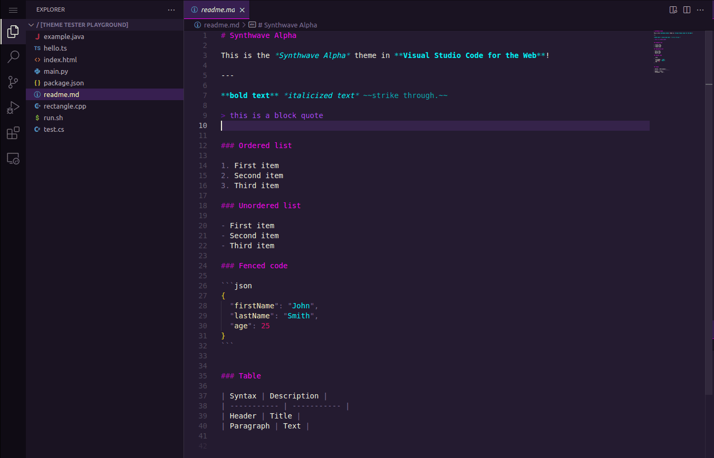

# Synthwave Alpha

*A Synthwave inspired dark mode theme for Visual Studio Code*

[**View demo**](https://vscode.dev/editor/theme/vikpe.synthwave-alpha)  -  [**Install**](https://marketplace.visualstudio.com/items?itemName=vikpe.synthwave-alpha)

## Installation
* [Install from Visual Studio Marketplace](https://marketplace.visualstudio.com/items?itemName=vikpe.synthwave-alpha)

Other options:
* Search for "**Synthwave Alpha**" in extensions.
* Press `CTRL+P` and enter `ext install vikpe.synthwave-alpha`

## Credits
Created by [vikpe](https://github.com/vikpe), based on the [Synthwave Alpha](https://github.com/vikpe/synthwave-alpha/) color palette.

Heavily inpired by the excellent [SynthWave '84 theme](https://github.com/robb0wen/synthwave-vscode) by [robb0wen](https://github.com/robb0wen)
